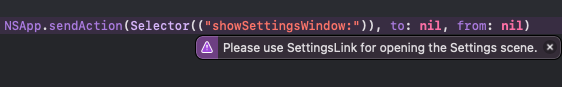

# SettingsAccess

[](https://developer.apple.com/swift)  [](https://developer.apple.com/swift) [](https://github.com/orchetect/SettingsAccess/blob/main/LICENSE)

## Why

As of macOS 14 Sonoma:

- Apple completely removed the ability to open the SwiftUI Settings scene using legacy `NSApp.sendAction()` method using the `showSettingsWindow:` (macOS 13) or `showPreferencesWindow:` (macOS 12 and earlier) selectors. The only available method of opening the Settings scene (apart from the _App menu → Settings_ menu item) is to use the new [`SettingsLink`](https://developer.apple.com/documentation/swiftui/settingslink) view.

  

- This presents two major restrictions:
  1. There is no way to detect when the user has clicked this button if additional code is desired to run before or after the opening of the `Settings` scene.
  2. There is **no** way to programmatically open the `Settings` scene.
  
- These restrictions become problematic in many scenarios. Some examples that are currently impossible without **SettingsAccess**:
  - You are building a window-based `MenuBarExtra` and want to have a button that activates the app, opens `Settings`, and then also dismisses the window.
  - You want to open the `Settings` scene in response to a user action in your application that requires the user manipulate a setting that may be invalid.

## Solution

- **SettingsAccess** provides a SwiftUI environment method called `openSettings()` that can be called anywhere in the view hierarchy to programmatically open the `Settings` scene.
  
  > Note: Due to SwiftUI limitations, this method is not usable within a `menu`-based `MenuBarExtra`. In that context, the custom `SettingsLink` initializer described below may be used.
- **SettingsAccess** also provides an initializer for `SettingsLink` which provides two closures allowing execution of arbitrary code before and/or after opening the `Settings` scene.
- The library is backwards compatible with macOS 11 Big Sur and later.
- No private API is used, so it is safe for the Mac App Store.

See [Getting Started](#Getting-Started) below for example usage.

## Using the Package

### Swift Package Manager (SPM)

Add SettingsAccess as a dependency using Swift Package Manager.

- In an app project or framework, in Xcode:

  Select the menu: **File → Swift Packages → Add Package Dependency...**

  Enter this URL: `https://github.com/orchetect/SettingsAccess`

- In a Swift Package, add it to the Package.swift dependencies:

  ```swift
  .package(url: "https://github.com/orchetect/SettingsAccess", from: "1.3.0")
  ```

## Getting Started

Import the library.

```swift
import SettingsAccess
```

### 1. Open Settings Programmatically

- Attach the `openSettingsAccess` view modifier to the base view whose subviews needs access to the `openSettings` method.

   ```swift
   @main
   struct MyApp: App {
       var body: some Scene {
           WindowGroup {
               ContentView()
                   .openSettingsAccess()
           }
           
           Settings { SettingsView() }
       }
   }
   ```

- In any subview where needed, add the environment method declaration. Then the `Settings` scene may be opened programmatically by calling this method.

   ```swift
   struct ContentView: View {
       @Environment(\.openSettings) private var openSettings
     
       var body: some View {
           Button("Open Settings") { try? openSettings() }
       }
   }
   ```

### 2. Use in a MenuBarExtra Menu

If using a menu-based `MenuBarExtra`, do not apply `openSettingsAccess()` to the menu content. `openSettings()` cannot be used there due to limitations of SwiftUI.

Instead, use the custom `SettingsLink` initializer to add a Settings menu item capable of running code before and/or after opening the `Settings` scene.

```swift
@main
struct MyApp: App {
    var body: some Scene {
        MenuBarExtra {
            AppMenuView()
                // Do not attach .openSettingsAccess()
        }
        
        Settings { SettingsView() }
    }
}

struct AppMenuView: View {
    var body: some View {
        SettingsLink { 
            Text("Settings...")
        } preAction: {
            // code to run before Settings opens
        } postAction: {
            // code to run after Settings opens
        }
        
        Button("Quit") { NSApp.terminate(nil) }
    }
}
```

## Example Code

Try the [Demo](Demo) example project to see the library in action.

## Requirements

Requires Xcode 15.0 or higher to build.

Once compiled, supports macOS 11.0 or higher.

## How It Works (For Nerds)

`SettingsLink` is a view that wraps a standard SwiftUI `Button` and its action calls a private environment method called `_openSettings` which we have no access to publicly. (A radar has been submitted asking Apple to make it public, but that may never happen.)

It is worth noting that due to how SwiftUI `Button` works, it is impossible to attach a simultaneous gesture to attempt to detect a button press.

The solution is the use of a custom `Button` style which, when applied directly to `SettingsLink`, allows us to capture the `Button` press action and export a wrapper method as an environment method called `openSettings` that we can use. This same button style can also let us run arbitrary code before and/or after the button action is triggered by the user.

More info and a deep-dive can be found in [this reddit post](https://www.reddit.com/r/SwiftUI/comments/16ibgy3/settingslink_on_macos_14_why_it_sucks_and_how_i/).

## Author

Coded by a bunch of 🐹 hamsters in a trenchcoat that calls itself [@orchetect](https://github.com/orchetect).

## License

Licensed under the MIT license. See [LICENSE](https://github.com/orchetect/SettingsAccess/blob/master/LICENSE) for details.

## Sponsoring

If you enjoy using SettingsAccess and want to contribute to open-source financially, GitHub sponsorship is much appreciated. Feedback and code contributions are also welcome.

## Contributions

Contributions are welcome. Posting in [Discussions](https://github.com/orchetect/SettingsAccess/discussions) first prior to new submitting PRs for features or modifications is encouraged.
